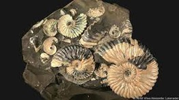

+++
title = "Paläontologie vs Genetik"
date = "2023-04-03"
draft = false
pinned = false
image = ""
+++

**Einleitung**

Am 21.02.2023, einem warmen Dienstagnachmittag, besuchten wir, Cedric und Finn das Naturhistorische Museum. Zusammen wollten wir unser Wissen über die Paläontologie aufrüsten, um das Wissen dann in diese Reportage einzubringen. Wir waren verabredet mit der Kuratorin Ursula Menkveld und dem Fossilienpräparator Gino Bernasconi.

«Die Paläontologie \[…] ist die Wissenschaft von den [Lebewesen](https://de.wikipedia.org/wiki/Lebewesen "Lebewesen") und [Lebewelten](https://de.wikipedia.org/wiki/Lebewelt "Lebewelt") der [geologischen Vergangenheit](https://de.wikipedia.org/wiki/Geologische_Zeitskala "Geologische Zeitskala"). Gegenstand paläontologischer Forschung sind [Fossilien](https://de.wikipedia.org/wiki/Fossil "Fossil") \[…], das heißt, in [Sedimentgesteinen](https://de.wikipedia.org/wiki/Sedimentgestein "Sedimentgestein") vorkommende körperliche Überreste sowie sonstige Hinterlassenschaften und Zeugnisse von Lebewesen, die älter als 10.000 Jahre sind.»

Mit Frau Menkveld unterhielten wir uns vor allem über die Paläontologie im Vergleich zu der Genetik. Zudem erzählte Sie uns, wie Paläontolog\*innnen arbeiten und was Paläontologie so spannend macht. Unter anderem erzählte Sie uns auch, dass wenn man Paläontolog\*in wird, dann interessiert man sich meist schon als Kind für Fossilien oder sammelt diese. Dass Hobbypaläontologen auch eine wichtige Rolle in der Paläontologie spielen, ist ein ebenfalls eine interessante Information, denn viele Fossilien, die in der Schweiz gefunden werden, werden von Hobbypaläontolog\*innen oder Paläontolog\*innen in deren Freizeit gefunden.

Nach einiger Zeit führte uns Frau Menkveld zu Gino Bernasconi, welcher uns die Arbeit als Fossilienpräparator präsentierte. Von ihm erfuhren wir, wie er manchmal 40 Stunden an einem einzigen Fossil verbringt und dieses zurecht präparierte. Er erzählte uns auch von einigen erstaunlichen Funden, einer war der Fund eines Fossils im Magen eines anderen Fossils drinnen. Er berichtete uns, wie man aufgrund solcher Funde sehr vieles interpretieren kann, unter anderem das Beuteschema des Urzeittieres.

Nach gut einer Stunde war unser Besuch im Naturhistorischen Museum vorbei und wir liefen mit Information beladen zurück ins Schulhaus. Rückblickend können wir sagen, dass uns der Besuch im Naturhistorischen Museum sehr gefallen hat und auf jeden Fall sehr informativ war.

**Die Möglichkeiten der Paläontologie**

Paläontologie ist für viele Menschen eine faszinierende Wissenschaft. Oft beginnt das Interesse an Fossilien schon im Kindesalter. Die Paläontologie beschäftigt sich im Allgemeinen mit der Erde vor unserer Zeitrechnung. Dabei bekommen Paläontolog*innen manchmal auf eine ganz besondere Weise einen Einblick, wie und in welcher Umgebung Tiere oder Pflanzen gelebt haben könnten. So auch Gino Bernasconi, Fossilienpräparator am Naturhistorischen Museum Bern. Wir haben uns mit ihm und Frau Ursula Menkveld dort verabredet. Mit Frau Menkveld tauschten wir uns über Genetik und Paläontologie aus, während wir mit Herrn Bernasconi über seine Erfahrungen sprachen. Wir durften dabei in das Zimmer für die Präparationen der Fossilien und erhielten somit gerade auch einen Einblick in die Tätigkeit von Herrn Bernasconi. Er erzählte uns, dass er früh an Fossilien interessiert war. Für ihn erzählt jedes Fossil seine eigene Geschichte. Zum Beispiel erzählte uns Herr Bernasconi, dass er einmal ein Fossil gefunden habe, welches einen Kiefer hatte, der in der Mitte um fast 90° gebrochen war.  Mit einem Fossil wie diesem lässt sich mehr als nur das Tier selbst rekonstruieren. Es ist möglich, auf die Todesursache dieses Tieres zu schliessen. Es gibt auch hin und wieder Fossilien, die Bisspuren aufweisen, oder bei denen man Knochen eines anderen Tiers gefunden hat. Selten kann man ganze Gruppen von Tieren finden. So kann man Rückschlüsse darauf ziehen, wie die Tiere zusammengelebt haben und ob sie Freund oder Feind waren.

Die Paläontologie kann noch mehr als das, denn mithilfe von Paläontologie lassen sich geologische Prozesse und Wetterphänomene erkennen. Vulkanausbrüche sind ein gutes Beispiel dafür, denn man kann sie in den verschiedenen Sedimentschichten nachweisen. Auch die Plattentektonik liess sich zum Teil mit Paläontologie belegen, da der deutsche Meteorologe, Polarforscher und Physiker Alfred Wegener Fossilien fand, die zur gleichen Art gehörten, jedoch auf verschiedenen Kontienten zu finden waren. Mithilfe von Paläontologie kann man auch die Veränderung der Landschaft über die Zeit analysieren, da verschiedene Sedimentschichten jeweils für eine andere Zeit stehen. So kann abgelesen werden, wie schnell und wann ein Gebirge entstanden ist. Auf diese Weise können auch die Sedimentschichten uns Geschichten davon erzählen, was sich auf der Erde vor unserer Zeit abgespielt hat.

**Die Grenzen der Paläontologie**

«Die Paläontologie ist eine sehr ungenaue Wissenschaft», meinte Ursula Menkveld, die Kuratorin des Naturhistorischen Museums, als wir Sie dort für ein Interview besuchten. Voller Vorfreude auf das Interview, schritten wir, gerüstet mit unseren Fragen über die Paläontologie, in das Museum, wo wir von Frau Menkveld erwartet wurden. Unter anderem erzählte sie uns, was die Aufgabe einer Paläontologin ist. Paläontologen*innen untersuchen Fossilien und interpretieren, welche Rolle diese in der Evolution spielten. Eine Hauptaufgabe von Ursula Menkveld ist das Rekonstruieren von Lebensräumen zum Beispiel mit Hilfe von den verschiedenen Fundstücken.

In den letzten Jahren hat die Genetik in der Wissenschaft immer mehr an Wichtigkeit gewonnen, die Paläontologie im Gegensatz, scheint in den letzten Jahren an Wichtigkeit verloren zu haben. Laut Ursula Menkveld sind Paläontologen weniger gefragt, einzig in Museen braucht es Paläontologen noch.

Paläontologie ist zweifelsohne eine sehr wichtige Wissenschaft und war uns Menschen in der Vergangenheit sehr behilflich, jedoch hat sie auch einige Mängel aufzuweisen. Findet man zum Beispiel ein altes Krokodil mit genetischen Spuren hat man mit der Genetik die Möglichkeit, die Verwandtschaft mit heutigen Krokodilen zu überprüfen und zu vergleichen, dies ist rein mit der Paläontologie nicht möglich. Eine andere Schwierigkeit in der Paläontologie ist die Auswertbarkeit der Fossilien. Ursula Menkveld meinte ausserdem, als wir Sie nach den Mängeln der Paläontologie gefragt haben, dass niemand wirklich der Paläontologie etwas entgegenhalten kann. Dies ist so gemeint, dass man sehr schlecht das Gegenteil beweisen kann. Wenn also ein Paläontologe ein Fossil eines Dinosauriers mit Bissspuren findet und dann sagt, der Dinosaurier sei durch einen Biss gestorben, könnte er auch z.B. ertrunken sein. Die Paläontologie ist wie gesagt eine sehr ungenaue Wissenschaft und hat viel mit Interpretation zu tun. Basierend auf Informationen, welche man aus einzelnen Fossilien herausnimmt, versuchen Paläontolog*innen die Vergangenheit zu rekonstruieren. Dies ist sehr schwierig und hat daher auch viel mit Hypothetik zu tun. In der Paläontologie kann man nie eindeutig sagen, wie es war, deswegen gibt es auch die Debatte, welche Farbe denn die Dinosaurier wirklich hatten, die Annahmen zu diesem Thema basieren eigentlich auf dem Vergleich mit den heutigen Vögeln. Dieser spekulative Teil zeigt klar die Grenzen der Paläontologie auf.

**Der Einsatz der Genetik**

Die Genetik setzt bei diesen Grenzen an. Zum Beispiel können Genetiker*innen die Verwandtschaft von verschiedenen Tieren genauer analysieren als die Paläontologie. So ist die Genetik auch im Allgemeinen viel präziser, denn bei der Paläontologie gibt es auch sehr viel Raum zum Interpretieren. Häufig wird dabei die heutige Verhaltensweise der Tiere betrachtet und auf die bereits ausgestorbenen übertragen. Das erzählte uns auch Frau Menkveld. Da man mit genetischen Analysen manche Dinge genauer festgestellt werden können, ist die Paläontologie in seltenen Fällen weniger gefragt. Wenn also Fossilien findet, bei denen noch genetische Überreste vorhanden sind, kann man mit Untersuchungen feststellen, mit welchem heute lebenden Tier das Fossil am nächsten verwandt ist. Vor allem die Fossilien, die 10'000 Jahre oder jünger sind, können oft genetische Spuren enthalten. Mit der Genetik lässt sich auch das Aussehen der Tiere besser erforschen. Die Paläontologie kann schliesslich nur anhand von Knochen und Gesteinen interpretieren. Mit genetischen Materialien könnte man sogar versuchen z.B. ein Mammut zu klonen, indem man einem Elefanten Mammutgene einpflanzt. Es ist sogar sehr wahrscheinlich, dass der Mensch in naher Zukunft Mammutähnliche Tiere Klonen könnte. Jedoch ist es laut Frau Menkveld praktisch unmöglich, dass man jemals eine Welt wie in dem Film "Jurassic Park" haben wird. Denn wenn je älter die Knochen des Tieres, desto weniger genetisches Material findet man darin. Frau Menkveld erzählte uns auch, dass es im Museum auch ein Genetiklabor gibt. Sie tauschen sich manchmal aus, jedoch finde keine enge Zusammenarbeit statt. Jedoch helfen die Kombinierten Daten von Paläontologie und Genetik unser Verständnis der Evolution und der Geschichte des Lebens auf der Erde zu erweitern und ein umfassenderes Bild der Evolution zu zeichnen. Somit würde es der Wissenschaft nichts bringen, wenn man die Paläontologie durch Genetik ersetzten würde. Dies stand für Frau Menkveld und auch für uns relativ schnell fest.